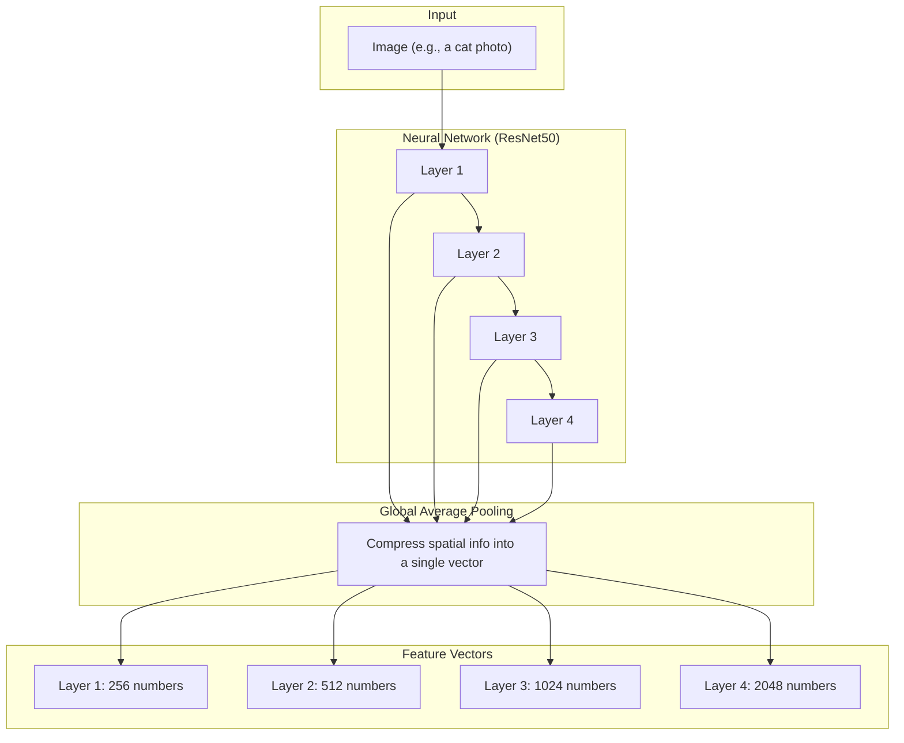

# CNN Feature Extraction Explained

This document explains how we extract features from images using a neural network.

## How It Works

## What Each Step Does

| Step | What Happens | Analogy |
|------|--------------|---------|
| **Input** | Feed an image to the network | Showing a photo to someone |
| **Layer 1-2** | Detect simple features | Noticing lines and textures |
| **Layer 3-4** | Detect complex features | Recognizing "this is a cat" |
| **Pooling** | Summarize each layer | Writing a brief description |
| **Output** | Numbers describing the image | A fingerprint for the image |

> [!TIP]
> **Why multiple layers?** Early layers see simple things (edges), late layers see complex things (objects). By extracting from multiple layers, we can compare how the brain processes images at different levels of abstraction.

## Why This Matters for RSA

Once we have these feature vectors, we can:
1. Compare how **similar** two images are according to each layer
2. Build a **similarity matrix** for all images
3. Compare the CNN's similarity judgments with **human brain data** (fMRI/MEG)

This helps us understand if the neural network "sees" images the same way humans do!
